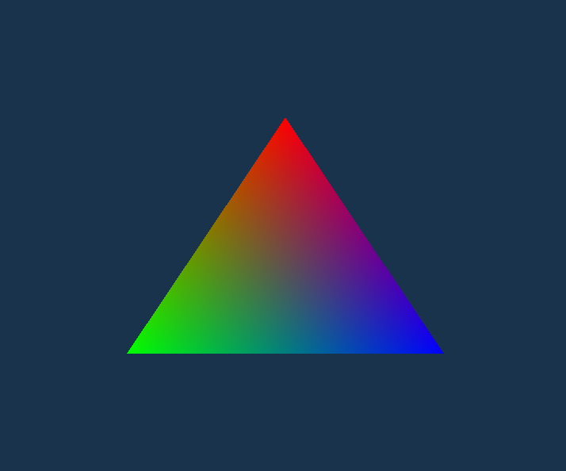
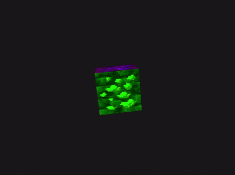

<h1 align="center" style="background: linear-gradient(90deg, #ff4500, #ff8c00); -webkit-background-clip: text; color: transparent; font-family:'Segoe UI', sans-serif;">
LearnOpenGL – Getting Started
</h1>

A collection of OpenGL mini-projects built while following the 
<a href="https://learnopengl.com/" style="color:#ff6347;">LearnOpenGL</a> tutorial series. 
Each section explores a different concept in modern OpenGL, from window creation to the camera system.

  

### 📂 Project Structure
| Folder | Topic | Description |
|:--|:--|:--|
| gl1 | Hello Window | Setting up GLFW and rendering a simple window. |
| gl2 | Hello Triangle | Drawing the first triangle using VBOs and VAOs. |
| gl3 | Shaders | Writing and compiling vertex & fragment shaders. |
| gl4 | Textures | Loading and applying textures using STB image. |
| gl5 | Transformations | Translating, rotating, and scaling objects. |
| gl6 | Coordinate Systems | Understanding view and projection matrices. |
| gl7 | Camera | Implementing a free-look FPS-style camera. |
| gl8 | Camera Refinement | Adding smooth motion and zoom controls. |
| gl9 | Combined Concepts | Experimenting with transformations and multiple cubes. |
| gl10 | Final – Camera Showcase | Bringing it all together with camera movement and perspective. |

### 🛠️ Tools & Libraries
- **C++17**
- **GLFW** – window & input management  
- **GLAD** – OpenGL function loader  
- **GLM** – mathematics (matrices, vectors)  
- **STB Image** – texture loading  

### 🚀 About
This repository documents my progress through the *Getting Started* section of LearnOpenGL. 
Each exercise focuses on understanding the fundamentals of the rendering pipeline — from vertices and shaders to transformations and camera control — laying the groundwork for future graphics projects.

  

<h3 align="center" style="background: linear-gradient(90deg, #ff4500, #ff8c00); -webkit-background-clip: text; color: transparent;">
Built with curiosity and passion for graphics programming.
</h3>
